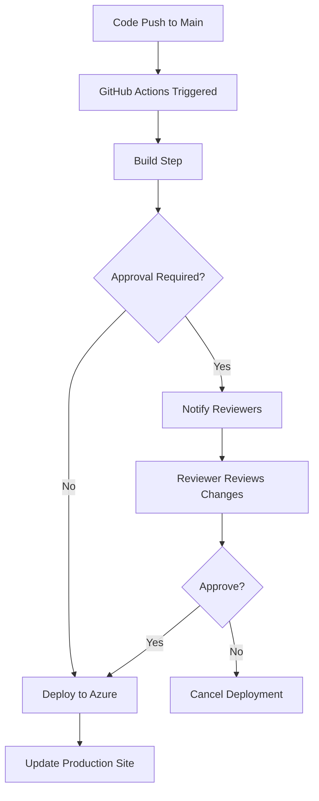

# Deployment Approval Setup Guide

## Overview
This guide walks you through setting up deployment approval controls for your Azure Static Web Apps deployment via GitHub Actions. With this setup, deployments to production will require manual approval from designated reviewers.

## What Was Changed

The GitHub Actions workflow [.github/workflows/azure-static-web-apps-lively-ocean-06ad20d10.yml](.github/workflows/azure-static-web-apps-lively-ocean-06ad20d10.yml) now references a `production` environment. This environment must be configured in GitHub with protection rules.

## Step-by-Step Setup

### 1. Configure GitHub Environment with Approval

1. **Navigate to Repository Settings**
   - Go to your GitHub repository: https://github.com/YOUR_USERNAME/Jawbreakers
   - Click on **Settings** tab
   - In the left sidebar, click **Environments**

2. **Create Production Environment**
   - Click **New environment**
   - Name: `production` (must match the workflow)
   - Click **Configure environment**

3. **Set Protection Rules**
   
   **Required reviewers:**
   - Check ✅ **Required reviewers**
   - Add up to 6 reviewers (GitHub usernames or team names)
   - You can add yourself and/or team members
   - At least one reviewer must approve before deployment proceeds
   
   **Wait timer (Optional):**
   - Check ✅ **Wait timer** to add a delay before deployment
   - Set delay in minutes (e.g., 5 minutes)
   
   **Deployment branches:**
   - Select **Selected branches**
   - Add branch rule: `main` (or your default branch)
   - This ensures only specific branches can deploy to production

4. **Save Protection Rules**
   - Click **Save protection rules**

### 2. How the Approval Process Works

Once configured, the deployment workflow will work as follows:

1. **Code Push to Main Branch**
   - Developer pushes code to `main` branch
   - GitHub Actions workflow is triggered automatically

2. **Workflow Pauses for Approval**
   - The workflow builds the project
   - Before deploying, it pauses and waits for approval
   - Designated reviewers receive a notification

3. **Reviewer Approves or Rejects**
   - Reviewer goes to **Actions** tab in GitHub
   - Clicks on the pending workflow run
   - Reviews the changes and deployment request
   - Clicks **Review deployments**
   - Selects `production` environment
   - Clicks **Approve and deploy** or **Reject**

4. **Deployment Proceeds or Stops**
   - If approved: Deployment continues to Azure
   - If rejected: Deployment is cancelled
   - Reviewer can leave comments explaining their decision

### 3. Testing the Approval Flow

1. **Make a Test Change**
   ```bash
   # Make a small change to any file
   git add .
   git commit -m "Test deployment approval flow"
   git push origin main
   ```

2. **Monitor GitHub Actions**
   - Go to **Actions** tab in your repository
   - Click on the running workflow
   - You should see it waiting for approval at the "Build and Deploy Job" step

3. **Approve the Deployment**
   - Click **Review deployments** button
   - Select `production` checkbox
   - Add optional comment
   - Click **Approve and deploy**

4. **Verify Deployment**
   - Workflow continues and deploys to Azure
   - Check your site: https://lively-ocean-06ad20d10.3.azurestaticapps.net

## Advanced Configuration Options

### Multiple Environments

You can create multiple environments for different deployment stages:

```yaml
jobs:
  build_job:
    runs-on: ubuntu-latest
    steps:
      - uses: actions/checkout@v3
      - name: Build
        run: echo "Building..."
  
  deploy_staging:
    needs: build_job
    runs-on: ubuntu-latest
    environment:
      name: staging
      url: https://staging.example.com
    steps:
      - name: Deploy to Staging
        run: echo "Deploying to staging..."
  
  deploy_production:
    needs: deploy_staging
    runs-on: ubuntu-latest
    environment:
      name: production
      url: https://lively-ocean-06ad20d10.3.azurestaticapps.net
    steps:
      - name: Deploy to Production
        run: echo "Deploying to production..."
```

### Environment Variables and Secrets

You can scope secrets to specific environments:

1. Go to **Settings** → **Secrets and variables** → **Actions**
2. Click **New environment secret**
3. Select your environment (e.g., `production`)
4. Add secret name and value
5. These secrets are only available to workflows deploying to that environment

### Deployment Branch Policies

Control which branches can deploy to each environment:

- **Any branch**: Any branch can trigger deployment (not recommended for production)
- **Protected branches only**: Only branches with branch protection rules
- **Selected branches**: Specify branch name patterns (e.g., `main`, `release/*`)

### Additional Protection Rules

- **Prevent self-review**: Reviewers can't approve their own deployments
- **Required reviewers from a specific team**: Require approval from specific GitHub teams
- **OIDC authentication**: Use GitHub's OIDC for secure Azure authentication (advanced)

## Notification Settings

Ensure reviewers receive notifications:

1. Go to personal **Settings** → **Notifications**
2. Enable notifications for **Actions**
3. Choose notification method (web, email, or mobile)

## Rollback Strategy

If a deployment needs to be rolled back:

1. **Quick Rollback via Git:**
   ```bash
   git revert HEAD
   git push origin main
   ```
   This triggers a new deployment with the previous version.

2. **Manual Rollback via Azure Portal:**
   - Go to Azure Static Web Apps
   - Click on your app
   - Go to **Deployment history**
   - Select a previous deployment
   - Click **Reactivate**

## Troubleshooting

### Issue: "Environment not found"
**Solution:** Ensure the environment name in the workflow matches exactly (case-sensitive) with the name created in GitHub Settings → Environments.

### Issue: Workflow doesn't pause for approval
**Solution:** 
- Verify protection rules are saved
- Check that the branch triggering the workflow matches the deployment branch policy
- Ensure you're pushing to the correct branch

### Issue: Reviewer doesn't receive notifications
**Solution:**
- Check GitHub notification settings
- Verify the reviewer has access to the repository
- Check email spam folder

### Issue: "Required reviewers not met"
**Solution:** Ensure at least one of the designated reviewers approves the deployment. Multiple reviewers can be added, but only one approval is needed by default.

## Best Practices

1. **Always use approval for production deployments**
2. **Add multiple reviewers** to avoid deployment bottlenecks
3. **Test in staging first** before deploying to production
4. **Document deployment decisions** in approval comments
5. **Set up Slack/Teams integration** for real-time approval notifications
6. **Review deployment history regularly** to track who approved what
7. **Use descriptive commit messages** to help reviewers understand changes

## Security Considerations

- **Limit who can approve deployments** to trusted team members
- **Use branch protection rules** on your main branch
- **Require pull request reviews** before merging to main
- **Enable "Required status checks"** to ensure tests pass before deployment
- **Audit deployment logs** regularly in GitHub Actions

## Resources

- [GitHub Environments Documentation](https://docs.github.com/en/actions/deployment/targeting-different-environments/using-environments-for-deployment)
- [GitHub Actions Approval Documentation](https://docs.github.com/en/actions/managing-workflow-runs/reviewing-deployments)
- [Azure Static Web Apps Documentation](https://docs.microsoft.com/azure/static-web-apps/)

## Quick Reference: Approval Workflow



## Summary

You've now configured deployment approval controls for your Jawbreakers project. Every deployment to Azure Static Web Apps will require manual approval from designated reviewers, giving you control over what goes live and when.

**Next Steps:**
1. Configure the `production` environment in GitHub Settings
2. Add yourself and other reviewers
3. Test the approval flow with a small change
4. Update your team on the new deployment process
